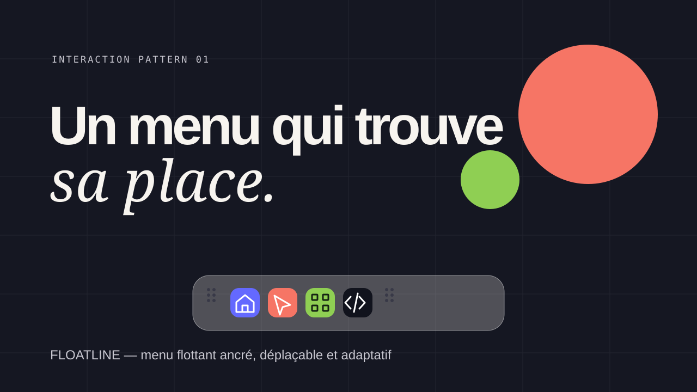

# Floatline



Un menu flottant, déplaçable et ancrable, pensé comme un composant d’interface expressif plutôt qu’une imitation de dock.

## Aperçu

Floatline accompagne la navigation d’une landing page et reste à portée, quelle que soit sa position dans la fenêtre.

## Fonctionnalités

- Déplacement à la souris et au tactile depuis l’une des deux poignées.
- Ancrage magnétique sur les quatre bords de la fenêtre.
- Mise en page horizontale en haut ou en bas ; verticale à gauche ou à droite.
- Ombre, rebond et libellés qui s’orientent selon le bord actif.
- Actions reliées aux sections de la page, avec indication de la section courante.
- Version responsive pour mobile et desktop.

## Voir la démo

Ouvrez `dist/index.html` dans un navigateur, ou servez le dossier avec votre serveur statique habituel.

## Structure

```text
dist/
  index.html    Page de démonstration
  style.css     Mise en forme et animations
  app.js        Déplacement, ancrage et navigation
assets/
  preview.svg   Aperçu utilisé dans ce README
```

## Licence

Ce projet est distribué sous licence [Creative Commons Attribution 4.0 International](LICENSE) (CC BY 4.0).

Vous pouvez partager et adapter ce travail, y compris à des fins commerciales, à condition de créditer le projet Floatline et d’indiquer si des modifications ont été apportées.

